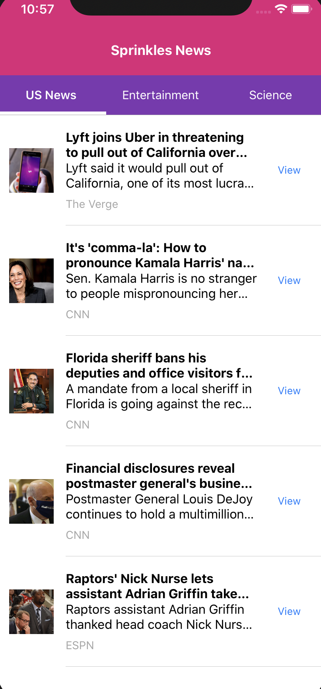

## SPRINKLES NEWS

# Lets Guess

   

## Project Description

Sprinkles News is a React Native project that fetches news articles from [NewsApi](https://newsapi.org/)



## Table of Contents

- [Installation](#installation)
- [Project Technology](#project-technology)
- [Screenshots of Application](#screenshots-of-application)
- [Contributing Authors](#contributing-authors)

---

## Installation

To install, run following command in terminal:

```
npx create-react-app
```

Install following Packages on Client Side

```
yarn install


```

Link React-Native

```
react-native link

```

Start React Native & Simulators

```
react-native run-ios/ run-android
```

## Project Technology

Languages

- Javascript

Libraries

- [React-Native](https://reactnative.dev/)
- [Native-Base](https://nativebase.io/)
- [React-Native-WebView](https://github.com/react-native-community/react-native-webview)

Yarn Packages

- [Yarn](https://classic.yarnpkg.com/en/)

API Site

- [NewsApi](https://newsapi.org/)

## Contributing Authors

Lindsey Lawson - [Github](https://github.com/lynseahoss)
